# System Architecture Analysis

## Overview

- **Project**: /home/tom/github/semcod/pfix
- **Primary Language**: python
- **Languages**: python: 15, shell: 1
- **Analysis Mode**: static
- **Total Functions**: 75
- **Total Classes**: 6
- **Modules**: 16
- **Entry Points**: 25

## Architecture by Module

### src.pfix.cli
- **Functions**: 9
- **File**: `cli.py`

### src.pfix.session
- **Functions**: 8
- **Classes**: 1
- **File**: `session.py`

### src.pfix.fixer
- **Functions**: 7
- **File**: `fixer.py`

### src.pfix.dependency
- **Functions**: 7
- **File**: `dependency.py`

### src.pfix.decorator
- **Functions**: 7
- **File**: `decorator.py`

### src.pfix.analyzer
- **Functions**: 6
- **Classes**: 1
- **File**: `analyzer.py`

### src.pfix.mcp_client
- **Functions**: 6
- **Classes**: 2
- **File**: `mcp_client.py`

### src.pfix.config
- **Functions**: 6
- **Classes**: 1
- **File**: `config.py`

### examples.demo_auto
- **Functions**: 4
- **File**: `demo_auto.py`

### examples.demo
- **Functions**: 4
- **File**: `demo.py`

### src.pfix.dev_mode
- **Functions**: 4
- **File**: `dev_mode.py`

### src.pfix.mcp_server
- **Functions**: 3
- **File**: `mcp_server.py`

### examples.complex_demo.main
- **Functions**: 3
- **File**: `main.py`

### src.pfix.llm
- **Functions**: 2
- **Classes**: 1
- **File**: `llm.py`

### src.pfix
- **Functions**: 1
- **File**: `__init__.py`

## Key Entry Points

Main execution flows into the system:

### src.pfix.config.PfixConfig.from_env
> Load config from .env + environment + pyproject.toml.
- **Calls**: cls, cls._read_pyproject, pyproject.items, load_dotenv, shutil.which, Path.cwd, env_file.exists, os.getenv

### src.pfix.cli.main
- **Calls**: argparse.ArgumentParser, parser.add_subparsers, sub.add_parser, run_p.add_argument, run_p.add_argument, run_p.add_argument, run_p.add_argument, run_p.add_argument

### src.pfix.decorator.pfix
> Self-healing decorator. Catches errors, fixes code via LLM.

Args:
    retries: Max fix attempts (default: config.max_retries).
    auto_apply: Apply 
- **Calls**: functools.wraps, decorator, src.pfix.config.get_config, range, fn, src.pfix.decorator._ensure_deps, fn, console.print

### src.pfix.session.PFixSession._handle_exception
> Handle exception — analyze and fix. Returns True if fixed.
- **Calls**: console.print, isinstance, src.pfix.analyzer.analyze_exception, src.pfix.analyzer.classify_error, console.print, src.pfix.llm.request_fix, src.pfix.fixer.apply_fix, src.pfix.dependency.detect_missing_from_error

### src.pfix.decorator.apfix
> Async version of @pfix.

Usage:
    @apfix
    async def fetch():
        ...
- **Calls**: functools.wraps, decorator, src.pfix.config.get_config, kwargs.get, range, fn, console.print, src.pfix.decorator._try_quick_dep_fix

### src.pfix.analyzer.ErrorContext.to_prompt
- **Calls**: parts.append, None.join, parts.append, parts.append, parts.append, parts.append, self.hints.items, list

### examples.demo_auto.main
- **Calls**: print, print, examples.demo_auto.fetch_json, print, print, examples.demo_auto.average, print, print

### examples.demo.main
- **Calls**: print, print, examples.demo.fetch_json, print, print, examples.demo.average, print, print

### src.pfix._auto_activate
> Check .env and auto-enable pfix if PFIX_AUTO_APPLY=true.
- **Calls**: Path.cwd, env_file.exists, None.lower, None.lower, inspect.currentframe, src.pfix.session.install_pfix_hook, load_dotenv, caller_globals.get

### src.pfix.mcp_client.MCPClient.call_tool
- **Calls**: MCPResult, resp.json, data.get, MCPResult, self._session.post, MCPResult, MCPResult, result.get

### examples.complex_demo.main.main
- **Calls**: print, print, examples.complex_demo.main.load_and_process_data, print, print, examples.complex_demo.main.analyze_users, print, print

### src.pfix.config.PfixConfig._read_pyproject
- **Calls**: None.get, path.exists, open, tomllib.load, data.get

### src.pfix.session.PFixSession.__init__
- **Calls**: src.pfix.config.get_config, inspect.currentframe, None.resolve, frame.f_back.f_globals.get, Path

### src.pfix.session.auto_pfix
> Decorator that auto-fixes exceptions in wrapped function.
- **Calls**: functools.wraps, decorator, inspect.getfile, PFixSession, fn

### src.pfix.mcp_client.MCPClient.connect
- **Calls**: httpx.AsyncClient, logger.warning

### src.pfix.mcp_client.MCPClient.edit_file
- **Calls**: MCPResult, self.call_tool

### src.pfix.mcp_client.MCPClient.run_command
- **Calls**: MCPResult, self.call_tool

### src.pfix.mcp_client.MCPClient.__init__
- **Calls**: src.pfix.config.get_config

### src.pfix.mcp_client.MCPClient.disconnect
- **Calls**: self._session.aclose

### src.pfix.config.PfixConfig.validate
- **Calls**: warnings.append

### src.pfix.session.PFixSession.__exit__
> Handle exception if one occurred. Returns True if handled.
- **Calls**: self._handle_exception

### src.pfix.session.PFixSession.__call__
> Run function with exception handling.
- **Calls**: func

### src.pfix.session.pfix_session
> Create pfix session for file-level auto-healing.
- **Calls**: PFixSession

### src.pfix.config.reset_config
> Reset global config (useful in tests).

### src.pfix.session.PFixSession.__enter__

## Process Flows

Key execution flows identified:

### Flow 1: from_env
```
from_env [src.pfix.config.PfixConfig]
```

### Flow 2: main
```
main [src.pfix.cli]
```

### Flow 3: pfix
```
pfix [src.pfix.decorator]
  └─ →> get_config
```

### Flow 4: _handle_exception
```
_handle_exception [src.pfix.session.PFixSession]
  └─ →> analyze_exception
  └─ →> classify_error
```

### Flow 5: apfix
```
apfix [src.pfix.decorator]
  └─ →> get_config
```

### Flow 6: to_prompt
```
to_prompt [src.pfix.analyzer.ErrorContext]
```

### Flow 7: _auto_activate
```
_auto_activate [src.pfix]
```

### Flow 8: call_tool
```
call_tool [src.pfix.mcp_client.MCPClient]
```

### Flow 9: _read_pyproject
```
_read_pyproject [src.pfix.config.PfixConfig]
```

### Flow 10: __init__
```
__init__ [src.pfix.session.PFixSession]
  └─ →> get_config
```

## Key Classes

### src.pfix.mcp_client.MCPClient
> Client for MCP servers (filesystem, editor tools).
- **Methods**: 6
- **Key Methods**: src.pfix.mcp_client.MCPClient.__init__, src.pfix.mcp_client.MCPClient.connect, src.pfix.mcp_client.MCPClient.disconnect, src.pfix.mcp_client.MCPClient.call_tool, src.pfix.mcp_client.MCPClient.edit_file, src.pfix.mcp_client.MCPClient.run_command

### src.pfix.session.PFixSession
> Session context that catches and auto-fixes exceptions.
- **Methods**: 5
- **Key Methods**: src.pfix.session.PFixSession.__init__, src.pfix.session.PFixSession.__enter__, src.pfix.session.PFixSession.__exit__, src.pfix.session.PFixSession.__call__, src.pfix.session.PFixSession._handle_exception

### src.pfix.config.PfixConfig
> Central configuration.
- **Methods**: 3
- **Key Methods**: src.pfix.config.PfixConfig.from_env, src.pfix.config.PfixConfig._read_pyproject, src.pfix.config.PfixConfig.validate

### src.pfix.llm.FixProposal
> Structured fix from LLM.
- **Methods**: 2
- **Key Methods**: src.pfix.llm.FixProposal.has_code_fix, src.pfix.llm.FixProposal.has_dependency_fix

### src.pfix.analyzer.ErrorContext
> Structured error report for LLM consumption.
- **Methods**: 1
- **Key Methods**: src.pfix.analyzer.ErrorContext.to_prompt

### src.pfix.mcp_client.MCPResult
- **Methods**: 0

## Data Transformation Functions

Key functions that process and transform data:

### src.pfix.fixer._validate_syntax
- **Output to**: ast.parse

### src.pfix.config.PfixConfig.validate
- **Output to**: warnings.append

### examples.complex_demo.main.load_and_process_data
> Load CSV, process it, return statistics.
- **Output to**: pd.read_csv, None.mean, len, list, None.sum

### src.pfix.llm._parse_response
> Parse LLM JSON response.
- **Output to**: FixProposal, raw.strip, re.search, data.get, data.get

## Behavioral Patterns

### recursion_install_packages
- **Type**: recursion
- **Confidence**: 0.90
- **Functions**: src.pfix.dependency.install_packages

### state_machine_MCPClient
- **Type**: state_machine
- **Confidence**: 0.70
- **Functions**: src.pfix.mcp_client.MCPClient.__init__, src.pfix.mcp_client.MCPClient.connect, src.pfix.mcp_client.MCPClient.disconnect, src.pfix.mcp_client.MCPClient.call_tool, src.pfix.mcp_client.MCPClient.edit_file

### state_machine_PFixSession
- **Type**: state_machine
- **Confidence**: 0.70
- **Functions**: src.pfix.session.PFixSession.__init__, src.pfix.session.PFixSession.__enter__, src.pfix.session.PFixSession.__exit__, src.pfix.session.PFixSession.__call__, src.pfix.session.PFixSession._handle_exception

## Public API Surface

Functions exposed as public API (no underscore prefix):

- `src.pfix.config.PfixConfig.from_env` - 52 calls
- `src.pfix.mcp_server.create_mcp_server` - 43 calls
- `src.pfix.fixer.apply_fix` - 37 calls
- `src.pfix.cli.cmd_enable` - 36 calls
- `src.pfix.cli.main` - 35 calls
- `src.pfix.session.install_pfix_hook` - 34 calls
- `src.pfix.decorator.pfix` - 27 calls
- `src.pfix.analyzer.analyze_exception` - 22 calls
- `src.pfix.cli.cmd_check` - 19 calls
- `src.pfix.cli.cmd_dev` - 18 calls
- `src.pfix.dependency.update_requirements_file` - 18 calls
- `src.pfix.cli.cmd_disable` - 16 calls
- `src.pfix.decorator.apfix` - 16 calls
- `src.pfix.cli.cmd_run` - 15 calls
- `src.pfix.analyzer.ErrorContext.to_prompt` - 13 calls
- `src.pfix.cli.cmd_deps` - 12 calls
- `src.pfix.dependency.install_packages` - 12 calls
- `src.pfix.dependency.scan_project_deps` - 12 calls
- `examples.demo_auto.main` - 11 calls
- `examples.demo.main` - 11 calls
- `src.pfix.analyzer.scan_missing_deps` - 11 calls
- `src.pfix.mcp_client.MCPClient.call_tool` - 11 calls
- `src.pfix.dev_mode.install_dev_mode_hook` - 9 calls
- `examples.complex_demo.main.main` - 9 calls
- `src.pfix.llm.request_fix` - 9 calls
- `src.pfix.dev_mode.wrap_module_functions` - 7 calls
- `src.pfix.dependency.generate_requirements` - 7 calls
- `examples.complex_demo.main.load_and_process_data` - 6 calls
- `src.pfix.mcp_server.start_server` - 5 calls
- `src.pfix.session.auto_pfix` - 5 calls
- `examples.demo.average` - 4 calls
- `src.pfix.config.configure` - 4 calls
- `src.pfix.dependency.detect_missing_from_error` - 4 calls
- `src.pfix.cli.cmd_server` - 3 calls
- `examples.complex_demo.main.analyze_users` - 3 calls
- `examples.demo_auto.fetch_json` - 2 calls
- `examples.demo_auto.average` - 2 calls
- `examples.demo.fetch_json` - 2 calls
- `src.pfix.mcp_client.MCPClient.connect` - 2 calls
- `src.pfix.mcp_client.MCPClient.edit_file` - 2 calls

## System Interactions

How components interact:

```mermaid
graph TD
    from_env --> cls
    from_env --> _read_pyproject
    from_env --> items
    from_env --> load_dotenv
    from_env --> which
    main --> ArgumentParser
    main --> add_subparsers
    main --> add_parser
    main --> add_argument
    pfix --> wraps
    pfix --> decorator
    pfix --> get_config
    pfix --> range
    pfix --> fn
    _handle_exception --> print
    _handle_exception --> isinstance
    _handle_exception --> analyze_exception
    _handle_exception --> classify_error
    apfix --> wraps
    apfix --> decorator
    apfix --> get_config
    apfix --> get
    apfix --> range
    to_prompt --> append
    to_prompt --> join
    main --> print
    main --> fetch_json
    _auto_activate --> cwd
    _auto_activate --> exists
    _auto_activate --> lower
```



## Reverse Engineering Guidelines

1. **Entry Points**: Start analysis from the entry points listed above
2. **Core Logic**: Focus on classes with many methods
3. **Data Flow**: Follow data transformation functions
4. **Process Flows**: Use the flow diagrams for execution paths
5. **API Surface**: Public API functions reveal the interface

## Context for LLM

Maintain the identified architectural patterns and public API surface when suggesting changes.