# System Architecture Analysis

## Overview

- **Project**: /home/tom/github/semcod/pfix
- **Primary Language**: python
- **Languages**: python: 104, shell: 1
- **Analysis Mode**: static
- **Total Functions**: 580
- **Total Classes**: 55
- **Modules**: 105
- **Entry Points**: 402

## Architecture by Module

### src.pfix.fixer
- **Functions**: 18
- **File**: `fixer.py`

### src.pfix.logging
- **Functions**: 18
- **Classes**: 5
- **File**: `logging.py`

### src.pfix.env_diagnostics.imports
- **Functions**: 15
- **Classes**: 1
- **File**: `imports.py`

### src.pfix.analyzer
- **Functions**: 14
- **File**: `analyzer.py`

### src.pfix.cache
- **Functions**: 14
- **Classes**: 1
- **File**: `cache.py`

### src.pfix.session
- **Functions**: 13
- **Classes**: 1
- **File**: `session.py`

### src.pfix.production
- **Functions**: 13
- **Classes**: 4
- **File**: `production.py`

### src.pfix.env_diagnostics.auto_fix
- **Functions**: 13
- **File**: `auto_fix.py`

### src.pfix.runtime_todo.collector
- **Functions**: 13
- **Classes**: 1
- **File**: `collector.py`

### src.pfix.config
- **Functions**: 12
- **Classes**: 1
- **File**: `config.py`

### src.pfix.env_diagnostics.filesystem
- **Functions**: 12
- **Classes**: 1
- **File**: `filesystem.py`

### src.pfix.decorator
- **Functions**: 11
- **File**: `decorator.py`

### src.pfix.env_diagnostics.python_version
- **Functions**: 11
- **Classes**: 1
- **File**: `python_version.py`

### examples.production.cascading_errors
- **Functions**: 11
- **File**: `cascading_errors.py`

### src.pfix.env_diagnostics.process
- **Functions**: 10
- **Classes**: 1
- **File**: `process.py`

### src.pfix.env_diagnostics.memory
- **Functions**: 10
- **Classes**: 1
- **File**: `memory.py`

### src.pfix.env_diagnostics.paths
- **Functions**: 10
- **Classes**: 1
- **File**: `paths.py`

### src.pfix.integrations.web
- **Functions**: 10
- **Classes**: 3
- **File**: `web.py`

### examples.production.api_patterns
- **Functions**: 10
- **File**: `api_patterns.py`

### src.pfix.env_diagnostics.config_env
- **Functions**: 9
- **Classes**: 1
- **File**: `config_env.py`

## Key Entry Points

Main execution flows into the system:

### src.pfix.commands.activation.cmd_enable
> Enable pfix auto-activation and add config to pyproject.toml.
- **Calls**: source_file.exists, pyproject.exists, console.print, console.print, console.print, console.print, console.print, console.print

### examples.imports.main.main
- **Calls**: print, print, print, exec, print, print, exec, print

### src.pfix.env_diagnostics.config_env.ConfigEnvDiagnostic._check_dotenv
> Check .env file.
- **Calls**: env_file.exists, env_example.exists, results.append, env_file.read_text, enumerate, env_file.exists, DiagnosticResult, content.splitlines

### src.pfix.env_diagnostics.imports.ImportDiagnostic._build_import_graph
> Build import dependency graph from project files.

Returns:
    Tuple of (module_imports, module_paths) where:
    - module_imports: dict mapping modu
- **Calls**: project_root.rglob, pyfile.relative_to, str, None.replace, None.replace, pyfile.read_text, ast.parse, src.pfix.cache.FixCache.set

### examples.run_all.main
- **Calls**: argparse.ArgumentParser, parser.add_argument, parser.add_argument, parser.add_argument, parser.parse_args, print, print, print

### src.pfix.multi_fix.find_related_files
> Find files related to the error through imports.

Args:
    source_file: File where error occurred
    error_ctx: Error context
    max_depth: How man
- **Calls**: src.pfix.cache.FixCache.set, src.pfix.cache.FixCache.set, sorted, to_process.pop, processed.add, current.exists, current.read_text, ast.parse

### src.pfix.session.PFixSession._handle_exception
> Handle exception — analyze and fix. Returns True if fixed.
- **Calls**: console.print, isinstance, src.pfix.analyzer.analyze_exception, src.pfix.analyzer.classify_error, console.print, src.pfix.llm.request_fix, src.pfix.fixer.apply_fix, src.pfix.dependency.detect_missing_from_error

### src.pfix.env_diagnostics.filesystem.FilesystemDiagnostic.check
> Run all filesystem checks.
- **Calls**: results.extend, results.extend, results.extend, results.extend, results.extend, results.extend, results.extend, results.extend

### src.pfix.commands.config.cmd_check
- **Calls**: src.pfix.config.get_config, config.validate, Table, table.add_column, table.add_column, console.print, console.print, table.add_row

### src.pfix.commands.run.cmd_dev
> Run with dependency development mode active.
- **Calls**: None.resolve, src.pfix.config.configure, console.print, console.print, console.print, src.pfix.dev_mode.install_dev_mode_hook, importlib.util.spec_from_file_location, importlib.util.module_from_spec

### src.pfix.multi_fix.parse_multi_file_response
> Parse LLM response for multi-file fix.

Args:
    raw: Raw LLM response text

Returns:
    MultiFileFixProposal or None if parsing fails
- **Calls**: raw.strip, re.search, m.group, json.loads, MultiFileFixProposal, text.startswith, console.print, text.find

### src.pfix.env_diagnostics.python_version.PythonVersionDiagnostic._check_pyproject_requires
> Check pyproject.toml requires-python vs current version.
- **Calls**: pyproject.exists, None.get, open, tomllib.load, data.get, re.search, re.search, results.append

### src.pfix.env_diagnostics.python_version.PythonVersionDiagnostic._check_version_features
> Check for version-specific features in code.
- **Calls**: project_root.rglob, str, pyfile.read_text, ast.parse, ast.walk, isinstance, isinstance, results.append

### src.pfix.env_diagnostics.imports.ImportDiagnostic._check_missing_imports
> Check for imports that aren't installed.
- **Calls**: src.pfix.cache.FixCache.set, project_root.rglob, hasattr, src.pfix.cache.FixCache.set, None.lower, str, self._extract_imports, all_imports.update

### src.pfix.runtime_todo.collector.RuntimeCollector._build_issue
> Build RuntimeIssue from exception.
- **Calls**: self._extract_frames, RuntimeIssue, ErrorFingerprint.compute, str, datetime.now, datetime.now, datetime.now, platform.python_version

### examples.production.main.main
- **Calls**: print, print, print, exec, print, print, exec, print

### examples.edge_cases.main.main
- **Calls**: print, print, print, exec, print, print, exec, print

### src.pfix.config.PfixConfig.from_env
> Load config from .env + environment + pyproject.toml.
- **Calls**: src.pfix.config._load_env_values, cls, cls._read_pyproject_full, None.get, pyproject.items, load_dotenv, Path.cwd, env_file.exists

### src.pfix._auto_activate._auto_activate_pfix
> Auto-activate pfix if configured in pyproject.toml or .env.
- **Calls**: src.pfix.config.get_config, Path.cwd, hasattr, None.lower, None.exists, any, src.pfix.session.install_pfix_hook, src.pfix._auto_activate._install_syntax_error_handler

### src.pfix.commands.activation.cmd_disable
> Disable pfix auto-activation.
- **Calls**: dest_file.exists, site.getsitepackages, Path, Path, console.print, console.print, site.getusersitepackages, site_packages.exists

### src.pfix.commands.run.cmd_run
- **Calls**: None.resolve, src.pfix.config.configure, src.pfix.commands.run._install_excepthook, importlib.util.spec_from_file_location, importlib.util.module_from_spec, script.is_file, console.print, str

### src.pfix.env_diagnostics.process.ProcessDiagnostic.check
> Run all process/OS checks.
- **Calls**: results.extend, results.extend, results.extend, results.extend, results.extend, results.extend, results.extend, results.extend

### src.pfix.env_diagnostics.memory.MemoryDiagnostic.check
> Run all memory checks.
- **Calls**: results.extend, results.extend, results.extend, results.extend, results.extend, results.extend, results.extend, results.extend

### src.pfix.env_diagnostics.EnvDiagnostics.__init__
- **Calls**: None.resolve, ImportDiagnostic, FilesystemDiagnostic, VenvDiagnostic, PythonVersionDiagnostic, MemoryDiagnostic, NetworkDiagnostic, ProcessDiagnostic

### src.pfix.env_diagnostics.python_version.PythonVersionDiagnostic.check
> Run all Python version checks.
- **Calls**: results.extend, results.extend, results.extend, results.extend, results.extend, results.extend, results.extend, results.extend

### src.pfix.env_diagnostics.paths.PathDiagnostic.check
> Run all path checks.
- **Calls**: results.extend, results.extend, results.extend, results.extend, results.extend, results.extend, results.extend, results.extend

### src.pfix.env_diagnostics.imports.ImportDiagnostic.check
> Run all import/dependency checks.
- **Calls**: results.extend, results.extend, results.extend, results.extend, results.extend, results.extend, results.extend, results.extend

### src.pfix.telemetry.get_telemetry_summary
> Get aggregate telemetry summary.
- **Calls**: len, sum, TELEMETRY_FILE.exists, open, sum, e.get, e.get, src.pfix.telemetry.is_telemetry_enabled

### src.pfix.env_diagnostics.encoding.EncodingDiagnostic._check_file_encoding
> Check Python files for encoding issues.
- **Calls**: project_root.rglob, str, content.startswith, open, f.read, results.append, content.decode, DiagnosticResult

### src.pfix.env_diagnostics.filesystem.FilesystemDiagnostic.diagnose_exception
> Diagnose filesystem-related exceptions.
- **Calls**: isinstance, isinstance, isinstance, DiagnosticResult, DiagnosticResult, DiagnosticResult, str, str

## Process Flows

Key execution flows identified:

### Flow 1: cmd_enable
```
cmd_enable [src.pfix.commands.activation]
```

### Flow 2: main
```
main [examples.imports.main]
```

### Flow 3: _check_dotenv
```
_check_dotenv [src.pfix.env_diagnostics.config_env.ConfigEnvDiagnostic]
```

### Flow 4: _build_import_graph
```
_build_import_graph [src.pfix.env_diagnostics.imports.ImportDiagnostic]
```

### Flow 5: find_related_files
```
find_related_files [src.pfix.multi_fix]
  └─ →> set
      └─ →> _make_cache_key
      └─ →> _proposal_to_json
  └─ →> set
      └─ →> _make_cache_key
      └─ →> _proposal_to_json
```

### Flow 6: _handle_exception
```
_handle_exception [src.pfix.session.PFixSession]
  └─ →> analyze_exception
      └─> _fill_traceback_context
          └─> _extract_frame_context
      └─> _fill_function_context
  └─ →> classify_error
```

### Flow 7: check
```
check [src.pfix.env_diagnostics.filesystem.FilesystemDiagnostic]
```

### Flow 8: cmd_check
```
cmd_check [src.pfix.commands.config]
  └─ →> get_config
```

### Flow 9: cmd_dev
```
cmd_dev [src.pfix.commands.run]
  └─ →> configure
```

### Flow 10: parse_multi_file_response
```
parse_multi_file_response [src.pfix.multi_fix]
```

## Key Classes

### src.pfix.env_diagnostics.imports.ImportDiagnostic
> Diagnose import and dependency problems.
- **Methods**: 15
- **Key Methods**: src.pfix.env_diagnostics.imports.ImportDiagnostic.check, src.pfix.env_diagnostics.imports.ImportDiagnostic._check_missing_imports, src.pfix.env_diagnostics.imports.ImportDiagnostic._build_import_graph, src.pfix.env_diagnostics.imports.ImportDiagnostic._find_cycle_dfs, src.pfix.env_diagnostics.imports.ImportDiagnostic._create_cycle_result, src.pfix.env_diagnostics.imports.ImportDiagnostic._check_circular_imports, src.pfix.env_diagnostics.imports.ImportDiagnostic._check_shadow_stdlib, src.pfix.env_diagnostics.imports.ImportDiagnostic._check_stale_bytecode, src.pfix.env_diagnostics.imports.ImportDiagnostic._check_version_conflicts, src.pfix.env_diagnostics.imports.ImportDiagnostic._check_missing_inits
- **Inherits**: BaseDiagnostic

### src.pfix.runtime_todo.collector.RuntimeCollector
> Captures runtime errors and writes to TODO.md.

Collection modes:
1. sys.excepthook — catches unhand
- **Methods**: 13
- **Key Methods**: src.pfix.runtime_todo.collector.RuntimeCollector.__init__, src.pfix.runtime_todo.collector.RuntimeCollector.capture, src.pfix.runtime_todo.collector.RuntimeCollector._should_capture, src.pfix.runtime_todo.collector.RuntimeCollector._build_issue, src.pfix.runtime_todo.collector.RuntimeCollector._extract_frames, src.pfix.runtime_todo.collector.RuntimeCollector._should_exclude_path, src.pfix.runtime_todo.collector.RuntimeCollector._filepath_to_module, src.pfix.runtime_todo.collector.RuntimeCollector._capture_locals, src.pfix.runtime_todo.collector.RuntimeCollector._classify, src.pfix.runtime_todo.collector.RuntimeCollector._severity

### src.pfix.env_diagnostics.filesystem.FilesystemDiagnostic
> Diagnose filesystem-related problems.
- **Methods**: 12
- **Key Methods**: src.pfix.env_diagnostics.filesystem.FilesystemDiagnostic.check, src.pfix.env_diagnostics.filesystem.FilesystemDiagnostic._check_disk_space, src.pfix.env_diagnostics.filesystem.FilesystemDiagnostic._check_file_references, src.pfix.env_diagnostics.filesystem.FilesystemDiagnostic._check_symlinks, src.pfix.env_diagnostics.filesystem.FilesystemDiagnostic._check_large_files, src.pfix.env_diagnostics.filesystem.FilesystemDiagnostic._check_writable, src.pfix.env_diagnostics.filesystem.FilesystemDiagnostic._check_inodes, src.pfix.env_diagnostics.filesystem.FilesystemDiagnostic._check_permissions, src.pfix.env_diagnostics.filesystem.FilesystemDiagnostic._check_filename_encoding, src.pfix.env_diagnostics.filesystem.FilesystemDiagnostic._check_case_conflicts
- **Inherits**: BaseDiagnostic

### src.pfix.env_diagnostics.python_version.PythonVersionDiagnostic
> Diagnose Python version compatibility problems.
- **Methods**: 11
- **Key Methods**: src.pfix.env_diagnostics.python_version.PythonVersionDiagnostic.check, src.pfix.env_diagnostics.python_version.PythonVersionDiagnostic._check_pyproject_requires, src.pfix.env_diagnostics.python_version.PythonVersionDiagnostic._check_version_features, src.pfix.env_diagnostics.python_version.PythonVersionDiagnostic._check_deprecated_imports, src.pfix.env_diagnostics.python_version.PythonVersionDiagnostic._get_deprecated_version, src.pfix.env_diagnostics.python_version.PythonVersionDiagnostic._check_eol_status, src.pfix.env_diagnostics.python_version.PythonVersionDiagnostic._check_32bit_python, src.pfix.env_diagnostics.python_version.PythonVersionDiagnostic._check_sys_executable_mismatch, src.pfix.env_diagnostics.python_version.PythonVersionDiagnostic._check_optimization_flags, src.pfix.env_diagnostics.python_version.PythonVersionDiagnostic._check_gil_status
- **Inherits**: BaseDiagnostic

### src.pfix.env_diagnostics.process.ProcessDiagnostic
> Diagnose process and OS-related problems.
- **Methods**: 10
- **Key Methods**: src.pfix.env_diagnostics.process.ProcessDiagnostic.check, src.pfix.env_diagnostics.process.ProcessDiagnostic._check_ulimits, src.pfix.env_diagnostics.process.ProcessDiagnostic._check_signal_handlers, src.pfix.env_diagnostics.process.ProcessDiagnostic._check_tmp_writable, src.pfix.env_diagnostics.process.ProcessDiagnostic._check_zombies, src.pfix.env_diagnostics.process.ProcessDiagnostic._check_nice_priority, src.pfix.env_diagnostics.process.ProcessDiagnostic._check_fd_usage, src.pfix.env_diagnostics.process.ProcessDiagnostic._check_core_dumps, src.pfix.env_diagnostics.process.ProcessDiagnostic._check_parent_alive, src.pfix.env_diagnostics.process.ProcessDiagnostic.diagnose_exception
- **Inherits**: BaseDiagnostic

### src.pfix.env_diagnostics.memory.MemoryDiagnostic
> Diagnose memory-related problems.
- **Methods**: 10
- **Key Methods**: src.pfix.env_diagnostics.memory.MemoryDiagnostic.check, src.pfix.env_diagnostics.memory.MemoryDiagnostic._check_available_memory, src.pfix.env_diagnostics.memory.MemoryDiagnostic._check_recursion_limit, src.pfix.env_diagnostics.memory.MemoryDiagnostic._check_gc_pressure, src.pfix.env_diagnostics.memory.MemoryDiagnostic._check_object_count, src.pfix.env_diagnostics.memory.MemoryDiagnostic._check_swap_usage, src.pfix.env_diagnostics.memory.MemoryDiagnostic._check_ulimits, src.pfix.env_diagnostics.memory.MemoryDiagnostic._check_shm_usage, src.pfix.env_diagnostics.memory.MemoryDiagnostic._check_process_memory, src.pfix.env_diagnostics.memory.MemoryDiagnostic.diagnose_exception
- **Inherits**: BaseDiagnostic

### src.pfix.env_diagnostics.paths.PathDiagnostic
> Diagnose path-related problems.
- **Methods**: 10
- **Key Methods**: src.pfix.env_diagnostics.paths.PathDiagnostic.check, src.pfix.env_diagnostics.paths.PathDiagnostic._check_sys_path, src.pfix.env_diagnostics.paths.PathDiagnostic._check_pythonpath, src.pfix.env_diagnostics.paths.PathDiagnostic._check_cwd_space, src.pfix.env_diagnostics.paths.PathDiagnostic._check_long_paths, src.pfix.env_diagnostics.paths.PathDiagnostic._check_cwd_deleted, src.pfix.env_diagnostics.paths.PathDiagnostic._check_root_permissions, src.pfix.env_diagnostics.paths.PathDiagnostic._check_tmp_writable, src.pfix.env_diagnostics.paths.PathDiagnostic._check_symlink_cycles, src.pfix.env_diagnostics.paths.PathDiagnostic.diagnose_exception
- **Inherits**: BaseDiagnostic

### src.pfix.env_diagnostics.config_env.ConfigEnvDiagnostic
> Diagnose configuration and environment variable problems.
- **Methods**: 9
- **Key Methods**: src.pfix.env_diagnostics.config_env.ConfigEnvDiagnostic.check, src.pfix.env_diagnostics.config_env.ConfigEnvDiagnostic._check_dotenv, src.pfix.env_diagnostics.config_env.ConfigEnvDiagnostic._check_required_vars, src.pfix.env_diagnostics.config_env.ConfigEnvDiagnostic._check_env_gitignore, src.pfix.env_diagnostics.config_env.ConfigEnvDiagnostic._check_pyproject_validity, src.pfix.env_diagnostics.config_env.ConfigEnvDiagnostic._check_pfix_config_missing, src.pfix.env_diagnostics.config_env.ConfigEnvDiagnostic._check_secret_exposure_env, src.pfix.env_diagnostics.config_env.ConfigEnvDiagnostic._check_conflicting_manifests, src.pfix.env_diagnostics.config_env.ConfigEnvDiagnostic.diagnose_exception
- **Inherits**: BaseDiagnostic

### src.pfix.env_diagnostics.hardware.HardwareDiagnostic
> Diagnose hardware-related problems.
- **Methods**: 8
- **Key Methods**: src.pfix.env_diagnostics.hardware.HardwareDiagnostic.check, src.pfix.env_diagnostics.hardware.HardwareDiagnostic._check_gpu_availability, src.pfix.env_diagnostics.hardware.HardwareDiagnostic._check_cpu_count, src.pfix.env_diagnostics.hardware.HardwareDiagnostic._check_docker_limits, src.pfix.env_diagnostics.hardware.HardwareDiagnostic._check_thermal_throttling, src.pfix.env_diagnostics.hardware.HardwareDiagnostic._check_battery_status, src.pfix.env_diagnostics.hardware.HardwareDiagnostic._check_avx_support, src.pfix.env_diagnostics.hardware.HardwareDiagnostic.diagnose_exception
- **Inherits**: BaseDiagnostic

### src.pfix.env_diagnostics.EnvDiagnostics
> Orchestrator for all environment diagnostics.
- **Methods**: 8
- **Key Methods**: src.pfix.env_diagnostics.EnvDiagnostics.__init__, src.pfix.env_diagnostics.EnvDiagnostics.check_all, src.pfix.env_diagnostics.EnvDiagnostics.diagnose_exception, src.pfix.env_diagnostics.EnvDiagnostics.generate_report, src.pfix.env_diagnostics.EnvDiagnostics._format_severity_section, src.pfix.env_diagnostics.EnvDiagnostics._generate_summary_footer, src.pfix.env_diagnostics.EnvDiagnostics._format_result, src.pfix.env_diagnostics.EnvDiagnostics.to_todo_issues

### src.pfix.env_diagnostics.network.NetworkDiagnostic
> Diagnose network-related problems.
- **Methods**: 8
- **Key Methods**: src.pfix.env_diagnostics.network.NetworkDiagnostic.check, src.pfix.env_diagnostics.network.NetworkDiagnostic._check_dns, src.pfix.env_diagnostics.network.NetworkDiagnostic._check_outbound, src.pfix.env_diagnostics.network.NetworkDiagnostic._check_ssl_certs, src.pfix.env_diagnostics.network.NetworkDiagnostic._check_proxy, src.pfix.env_diagnostics.network.NetworkDiagnostic._check_latency, src.pfix.env_diagnostics.network.NetworkDiagnostic._check_system_clock, src.pfix.env_diagnostics.network.NetworkDiagnostic.diagnose_exception
- **Inherits**: BaseDiagnostic

### src.pfix.runtime_todo.todo_file.TodoFile
> Thread-safe, append-only manager for TODO.md.

Features:
- File locking (fcntl on Linux/Unix)
- Appe
- **Methods**: 8
- **Key Methods**: src.pfix.runtime_todo.todo_file.TodoFile.__init__, src.pfix.runtime_todo.todo_file.TodoFile.append_issue, src.pfix.runtime_todo.todo_file.TodoFile._file_lock, src.pfix.runtime_todo.todo_file.TodoFile._load_existing_fingerprints, src.pfix.runtime_todo.todo_file.TodoFile._increment_counter, src.pfix.runtime_todo.todo_file.TodoFile._append_new_entry, src.pfix.runtime_todo.todo_file.TodoFile._format_entry, src.pfix.runtime_todo.todo_file.TodoFile.get_section_content

### src.pfix.env_diagnostics.encoding.EncodingDiagnostic
> Diagnose encoding-related problems.
- **Methods**: 7
- **Key Methods**: src.pfix.env_diagnostics.encoding.EncodingDiagnostic.check, src.pfix.env_diagnostics.encoding.EncodingDiagnostic._check_locale, src.pfix.env_diagnostics.encoding.EncodingDiagnostic._check_file_encoding, src.pfix.env_diagnostics.encoding.EncodingDiagnostic._check_line_endings, src.pfix.env_diagnostics.encoding.EncodingDiagnostic._check_stdio_encoding, src.pfix.env_diagnostics.encoding.EncodingDiagnostic._check_os_environ_encoding, src.pfix.env_diagnostics.encoding.EncodingDiagnostic.diagnose_exception
- **Inherits**: BaseDiagnostic

### src.pfix.mcp_client.MCPClient
> Client for MCP servers (filesystem, editor tools).
- **Methods**: 6
- **Key Methods**: src.pfix.mcp_client.MCPClient.__init__, src.pfix.mcp_client.MCPClient.connect, src.pfix.mcp_client.MCPClient.disconnect, src.pfix.mcp_client.MCPClient.call_tool, src.pfix.mcp_client.MCPClient.edit_file, src.pfix.mcp_client.MCPClient.run_command

### src.pfix.production.PfixMonitor
> Production-safe error monitor. Never modifies code.
- **Methods**: 6
- **Key Methods**: src.pfix.production.PfixMonitor.__init__, src.pfix.production.PfixMonitor.watch, src.pfix.production.PfixMonitor.handle_exception, src.pfix.production.PfixMonitor._log_proposal, src.pfix.production.PfixMonitor._send_webhook, src.pfix.production.PfixMonitor.get_stats

### src.pfix.cache.FixCache
> Cache for fix proposals to avoid redundant LLM calls.
- **Methods**: 6
- **Key Methods**: src.pfix.cache.FixCache.__init__, src.pfix.cache.FixCache.get, src.pfix.cache.FixCache.set, src.pfix.cache.FixCache.clear, src.pfix.cache.FixCache.stats, src.pfix.cache.FixCache.close

### src.pfix.env_diagnostics.concurrency.ConcurrencyDiagnostic
> Diagnose concurrency-related problems.
- **Methods**: 6
- **Key Methods**: src.pfix.env_diagnostics.concurrency.ConcurrencyDiagnostic.check, src.pfix.env_diagnostics.concurrency.ConcurrencyDiagnostic._check_thread_count, src.pfix.env_diagnostics.concurrency.ConcurrencyDiagnostic._check_asyncio_loop, src.pfix.env_diagnostics.concurrency.ConcurrencyDiagnostic._check_thread_hangs, src.pfix.env_diagnostics.concurrency.ConcurrencyDiagnostic._check_async_lag, src.pfix.env_diagnostics.concurrency.ConcurrencyDiagnostic.diagnose_exception
- **Inherits**: BaseDiagnostic

### src.pfix.env_diagnostics.third_party.ThirdPartyDiagnostic
> Diagnose third-party API-related problems.
- **Methods**: 6
- **Key Methods**: src.pfix.env_diagnostics.third_party.ThirdPartyDiagnostic.check, src.pfix.env_diagnostics.third_party.ThirdPartyDiagnostic._check_api_keys_in_env, src.pfix.env_diagnostics.third_party.ThirdPartyDiagnostic._check_hardcoded_key, src.pfix.env_diagnostics.third_party.ThirdPartyDiagnostic._check_missing_timeout, src.pfix.env_diagnostics.third_party.ThirdPartyDiagnostic._check_api_client_configs, src.pfix.env_diagnostics.third_party.ThirdPartyDiagnostic.diagnose_exception
- **Inherits**: BaseDiagnostic

### src.pfix.env_diagnostics.serialization.SerializationDiagnostic
> Diagnose serialization-related problems.
- **Methods**: 6
- **Key Methods**: src.pfix.env_diagnostics.serialization.SerializationDiagnostic.check, src.pfix.env_diagnostics.serialization.SerializationDiagnostic._check_pickle_protocol, src.pfix.env_diagnostics.serialization.SerializationDiagnostic._check_cache_files, src.pfix.env_diagnostics.serialization.SerializationDiagnostic._check_yaml_safety, src.pfix.env_diagnostics.serialization.SerializationDiagnostic._check_json_manifest_validity, src.pfix.env_diagnostics.serialization.SerializationDiagnostic.diagnose_exception
- **Inherits**: BaseDiagnostic

### src.pfix.logging.SQLiteLogger
> SQLite-based logger for FixEvents with querying capabilities.
- **Methods**: 5
- **Key Methods**: src.pfix.logging.SQLiteLogger.__init__, src.pfix.logging.SQLiteLogger._init_db, src.pfix.logging.SQLiteLogger.log, src.pfix.logging.SQLiteLogger.query, src.pfix.logging.SQLiteLogger.get_stats

## Data Transformation Functions

Key functions that process and transform data:

### src.pfix.cli._build_parser
> Build and configure ArgumentParser for pfix CLI.
- **Output to**: argparse.ArgumentParser, parser.add_subparsers, sub.add_parser, run_p.add_argument, run_p.add_argument

### src.pfix.multi_fix.parse_multi_file_response
> Parse LLM response for multi-file fix.

Args:
    raw: Raw LLM response text

Returns:
    MultiFile
- **Output to**: raw.strip, re.search, m.group, json.loads, MultiFileFixProposal

### src.pfix.fixer._confirm_and_validate
> Check permissions, show diff, and get user confirmation. CC≤5.
- **Output to**: src.pfix.permissions.check_all_permissions, src.pfix.fixer._display_diff, console.print, src.pfix.fixer._record_fix_telemetry, console.print

### src.pfix.fixer._validate_syntax
- **Output to**: ast.parse

### src.pfix.diff_fixer.parse_unified_diff
> Parse unified diff text into hunks.

Returns list of (old_path, new_path, hunk_lines).
- **Output to**: diff_text.splitlines, len, line.startswith, None.strip, None.strip

### src.pfix.diff_fixer.parse_hunk_header
> Parse hunk header like @@ -1,5 +1,7 @@.

Returns (old_start, old_count, new_start, new_count).
- **Output to**: re.match, int, int, DiffParseError, match.group

### src.pfix.config.PfixConfig.validate
- **Output to**: warnings.append

### src.pfix.validation.validate_fix
> Validate a fix by running tests.

If tests fail and rollback is enabled, restore from backup.

Args:
- **Output to**: src.pfix.config.get_config, getattr, src.pfix.validation.run_tests, console.print, console.print

### src.pfix.validation.quick_validate_syntax
> Quick syntax validation for a single file.
- **Output to**: filepath.read_text, ast.parse

### src.pfix.validation.validate_with_fallback
> Full validation workflow with fallback.

1. Validate syntax
2. Run tests
3. Rollback if needed
- **Output to**: Path, src.pfix.validation.validate_fix, console.print, ValidationResult, src.pfix.validation.quick_validate_syntax

### src.pfix.session._restart_process
> Restart current process. CC≤2.
- **Output to**: console.print, os.execv, src.pfix.analyzer.analyze_exception, src.pfix.session._clear_pycache, Path

### src.pfix.commands.diagnose._format_diagnostic_results
> Format diagnostic results for output (JSON or text).
- **Output to**: json.dumps, diag.generate_report

### src.pfix.env_diagnostics.memory.MemoryDiagnostic._check_process_memory
> Check if current process occupies too much of system memory.
- **Output to**: psutil.Process, proc.memory_info, os.getpid, psutil.virtual_memory, results.append

### src.pfix.env_diagnostics.EnvDiagnostics._format_severity_section
> Format a section of results with given status.
- **Output to**: lines.append, lines.append, self._format_result

### src.pfix.env_diagnostics.EnvDiagnostics._format_result
> Format single result as markdown.
- **Output to**: lines.append, lines.append, lines.append, None.join, lines.append

### src.pfix.integrations.sentry.PfixSentryIntegration._process_event
> Process Sentry event to add pfix context.
- **Output to**: hint.get, src.pfix.analyzer.analyze_exception, src.pfix.llm.request_fix, len

### src.pfix.runtime_todo.todo_file.TodoFile._format_entry
> Format RuntimeIssue as markdown TODO entry.
- **Output to**: enumerate, issue.timestamp.strftime, trace_parts.append, None.join, Path

### examples.complex_demo.main.load_and_process_data
> Load CSV, process it, return statistics.
- **Output to**: pd.read_csv, None.mean, len, list, None.sum

### examples.memory.main.process_stream
- **Output to**: src.pfix.decorator.pfix, range, len, list, results.extend

### examples.production.degradation.parse_api_v2_response
- **Output to**: src.pfix.decorator.pfix

### examples.encoding.unicode_errors.process_api_response
- **Output to**: src.pfix.decorator.pfix

### examples.encoding.unicode_errors.format_price
- **Output to**: src.pfix.decorator.pfix

### examples.production.api_patterns.validate_payload
- **Output to**: int, ValueError, body.get

### examples.production.api_patterns.serialize_response
- **Output to**: sum, len

### examples.production.api_patterns.transform_records
- **Output to**: None.upper

## Behavioral Patterns

### recursion_install_packages
- **Type**: recursion
- **Confidence**: 0.90
- **Functions**: src.pfix.dependency.install_packages

### state_machine_MCPClient
- **Type**: state_machine
- **Confidence**: 0.70
- **Functions**: src.pfix.mcp_client.MCPClient.__init__, src.pfix.mcp_client.MCPClient.connect, src.pfix.mcp_client.MCPClient.disconnect, src.pfix.mcp_client.MCPClient.call_tool, src.pfix.mcp_client.MCPClient.edit_file

### state_machine_PFixSession
- **Type**: state_machine
- **Confidence**: 0.70
- **Functions**: src.pfix.session.PFixSession.__init__, src.pfix.session.PFixSession.__enter__, src.pfix.session.PFixSession.__exit__, src.pfix.session.PFixSession.__call__, src.pfix.session.PFixSession._handle_exception

## Public API Surface

Functions exposed as public API (no underscore prefix):

- `src.pfix.init_wizard.init_wizard` - 42 calls
- `src.pfix.commands.activation.cmd_enable` - 36 calls
- `src.pfix.dashboard.render_dashboard` - 32 calls
- `examples.imports.main.main` - 27 calls
- `src.pfix.dashboard.get_log_stats` - 25 calls
- `examples.run_all.main` - 21 calls
- `src.pfix.multi_fix.find_related_files` - 21 calls
- `src.pfix.env_diagnostics.filesystem.FilesystemDiagnostic.check` - 20 calls
- `src.pfix.diff_fixer.parse_unified_diff` - 19 calls
- `src.pfix.commands.config.cmd_check` - 19 calls
- `src.pfix.commands.run.cmd_dev` - 19 calls
- `src.pfix.multi_fix.parse_multi_file_response` - 18 calls
- `src.pfix.rollback.rollback_file` - 18 calls
- `src.pfix.dependency.update_requirements_file` - 18 calls
- `src.pfix.audit.print_audit_report` - 18 calls
- `examples.production.main.main` - 17 calls
- `examples.edge_cases.main.main` - 17 calls
- `src.pfix.config.PfixConfig.from_env` - 16 calls
- `src.pfix.commands.activation.cmd_disable` - 16 calls
- `src.pfix.commands.run.cmd_run` - 16 calls
- `src.pfix.env_diagnostics.process.ProcessDiagnostic.check` - 16 calls
- `src.pfix.env_diagnostics.memory.MemoryDiagnostic.check` - 16 calls
- `src.pfix.env_diagnostics.python_version.PythonVersionDiagnostic.check` - 16 calls
- `src.pfix.env_diagnostics.paths.PathDiagnostic.check` - 16 calls
- `src.pfix.env_diagnostics.imports.ImportDiagnostic.check` - 16 calls
- `src.pfix.runtime_todo.get_collector` - 16 calls
- `src.pfix.telemetry.get_telemetry_summary` - 15 calls
- `src.pfix.validation.run_tests` - 15 calls
- `src.pfix.rollback.show_history` - 15 calls
- `src.pfix.env_diagnostics.filesystem.FilesystemDiagnostic.diagnose_exception` - 15 calls
- `src.pfix.integrations.precommit.check_imports` - 15 calls
- `src.pfix.integrations.precommit.main` - 15 calls
- `examples.reset.main` - 14 calls
- `src.pfix.production.PfixMonitor.handle_exception` - 14 calls
- `src.pfix.cache.FixCache.set` - 14 calls
- `src.pfix.env_diagnostics.config_env.ConfigEnvDiagnostic.check` - 14 calls
- `src.pfix.diff_fixer.apply_diff` - 13 calls
- `src.pfix.types.ErrorContext.to_prompt` - 13 calls
- `src.pfix.audit.log_fix_audit` - 13 calls
- `src.pfix.env_diagnostics.EnvDiagnostics.generate_report` - 13 calls

## System Interactions

How components interact:

```mermaid
graph TD
    cmd_enable --> exists
    cmd_enable --> print
    main --> print
    main --> exec
    _check_dotenv --> exists
    _check_dotenv --> append
    _check_dotenv --> read_text
    _check_dotenv --> enumerate
    _build_import_graph --> rglob
    _build_import_graph --> relative_to
    _build_import_graph --> str
    _build_import_graph --> replace
    main --> ArgumentParser
    main --> add_argument
    main --> parse_args
    find_related_files --> set
    find_related_files --> sorted
    find_related_files --> pop
    find_related_files --> add
    _handle_exception --> print
    _handle_exception --> isinstance
    _handle_exception --> analyze_exception
    _handle_exception --> classify_error
    check --> extend
    cmd_check --> get_config
    cmd_check --> validate
    cmd_check --> Table
    cmd_check --> add_column
    cmd_dev --> resolve
    cmd_dev --> configure
```



## Reverse Engineering Guidelines

1. **Entry Points**: Start analysis from the entry points listed above
2. **Core Logic**: Focus on classes with many methods
3. **Data Flow**: Follow data transformation functions
4. **Process Flows**: Use the flow diagrams for execution paths
5. **API Surface**: Public API functions reveal the interface

## Context for LLM

Maintain the identified architectural patterns and public API surface when suggesting changes.